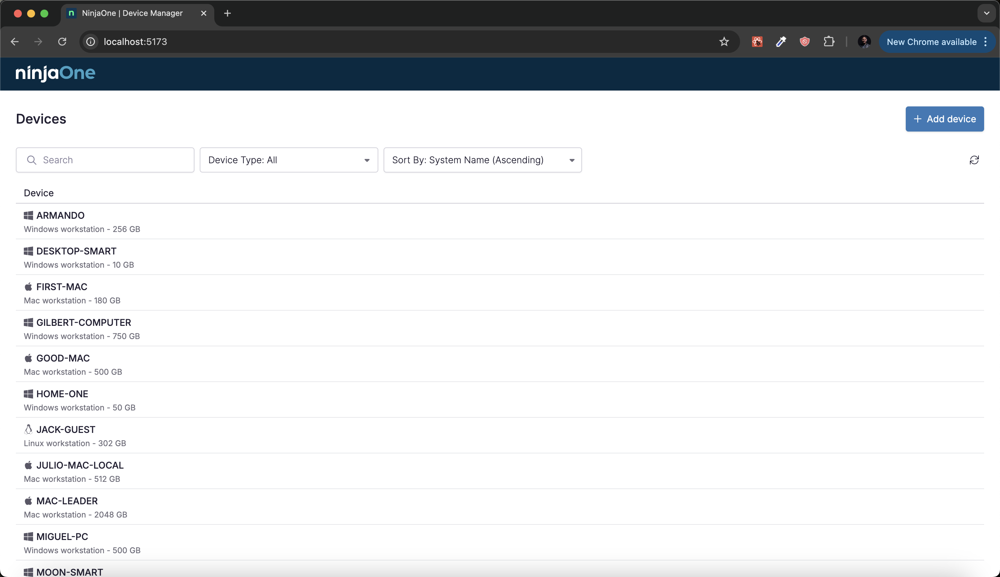
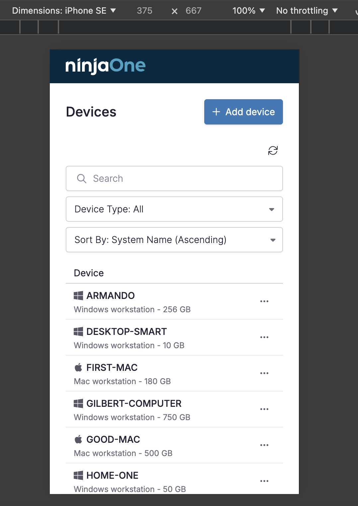
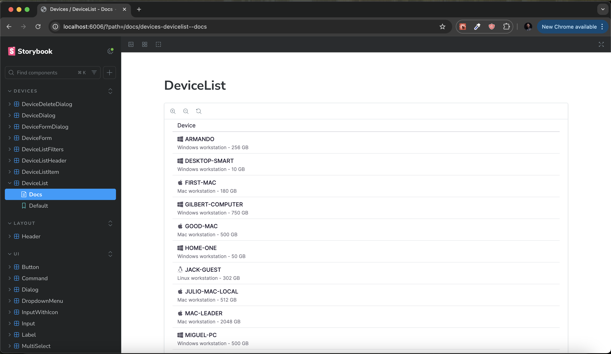

# NinjaOne Device Manager

<div style="display: flex; gap: 20px; margin-bottom: 20px;">
  
  
</div>

A responsive web application built for NinjaOne's technical challenge that manages device inventory with CRUD operations, filtering, and sorting capabilities.

## 🚀 Features

- **Device Management**

  - Create, Read, Update and Delete devices
  - Support for Windows, Mac and Linux devices
  - Track system name and HDD capacity

- **Advanced Filtering & Sorting**
  - Filter devices by single or multiple types
  - Sort by system name or HDD capacity
  - Responsive design for all screen sizes

## 💻 Tech Stack

- **Framework:** React with TypeScript
- **Build Tool:** Vite
- **Data Management:** React Query
- **UI Components:** Shadcn UI
- **Testing:** Vitest
- **Documentation:** Storybook
- **Styling:** Tailwind CSS with centralized theming

## 📚 Getting Started

### Prerequisites

- Node.js (version 18 or higher)
- npm or yarn

### Installation

1. Clone the repository

```bash
git clone https://github.com/leandrovi/ninjaone-client.git
cd ninjaone-client
```

2. Install dependencies

```bash
npm install
# or
yarn
```

### Running the Application

```bash
npm run dev     # Start development server
# or
yarn dev
```

The application will be available at `http://localhost:5173`

### Running Tests

```bash
npm run test          # Run tests
npm run coverage # Run tests with coverage report
# or
yarn test
yarn coverage
```

### Running Storybook

```bash
npm run storybook  # Start Storybook server
# or
yarn storybook
```

Storybook will be available at `http://localhost:6006`

### Building for Production

```bash
npm run build  # Create production build
# or
yarn build
```

## 📚 Architecture

The project follows a clean and modular architecture:

```
src/
├── components/
│   ├── ui/          # Atomic components
│   ├── devices/     # Device feature components
│   └── layout/      # Layout components
├── lib/             # Utilities and configurations
├── styles/          # Global styles and theme
├── context/         # Global context
├── types/           # TypeScript types
├── assets/          # Static assets
└── hooks/           # Custom hooks
```

## 📖 Documentation

All components are thoroughly documented using Storybook, making it easy for developers to understand and reuse components.



## ✅ Testing

The application includes comprehensive unit tests written with Vitest to ensure reliability and maintainability.


## 🎯 Project Objectives

This project was developed as part of NinjaOne's technical challenge with the following requirements:

- Implement CRUD operations for device management
- Support filtering by device type
- Enable sorting by name and HDD capacity
- Ensure responsive design
- Maintain clean code architecture

## 🔍 Additional Features

Beyond the core requirements, this implementation includes:

- Multi-type filtering
- Comprehensive test coverage
- Component documentation
- Responsive design
- Type-safe development with TypeScript

## 🤝 About the Developer

Built with ❤️ by [Leandro Vieira](https://linkedin.com/in/leandrofv)

## 📝 License

This project is MIT licensed.
